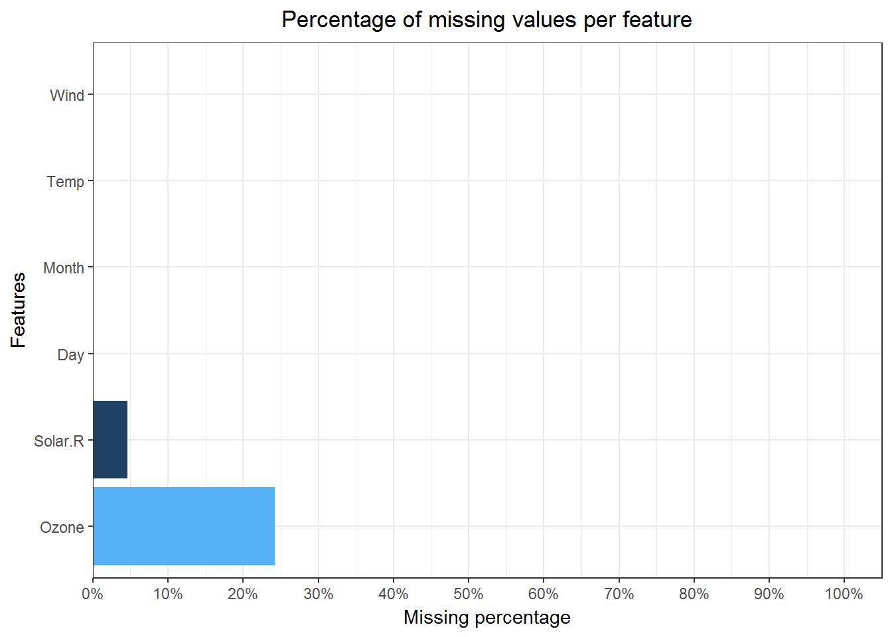
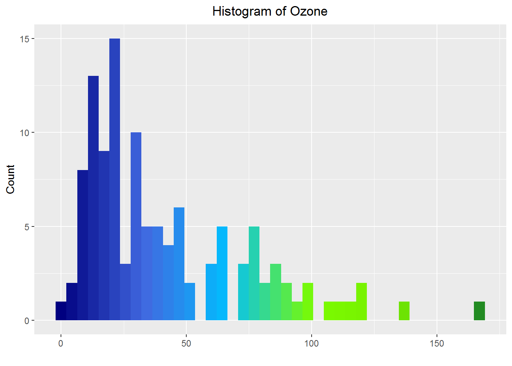
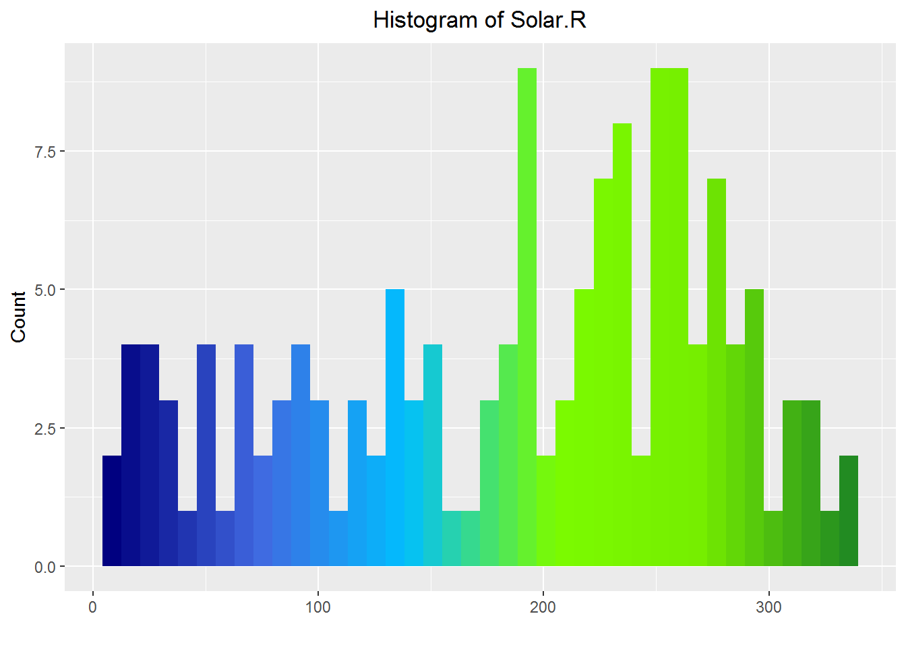
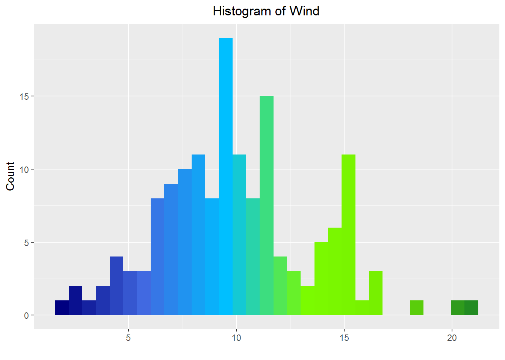
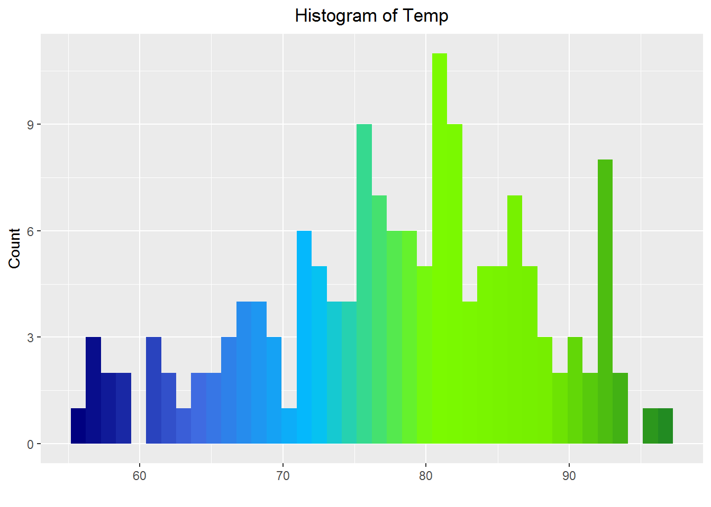
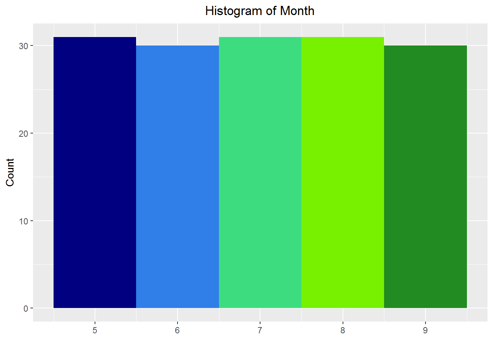
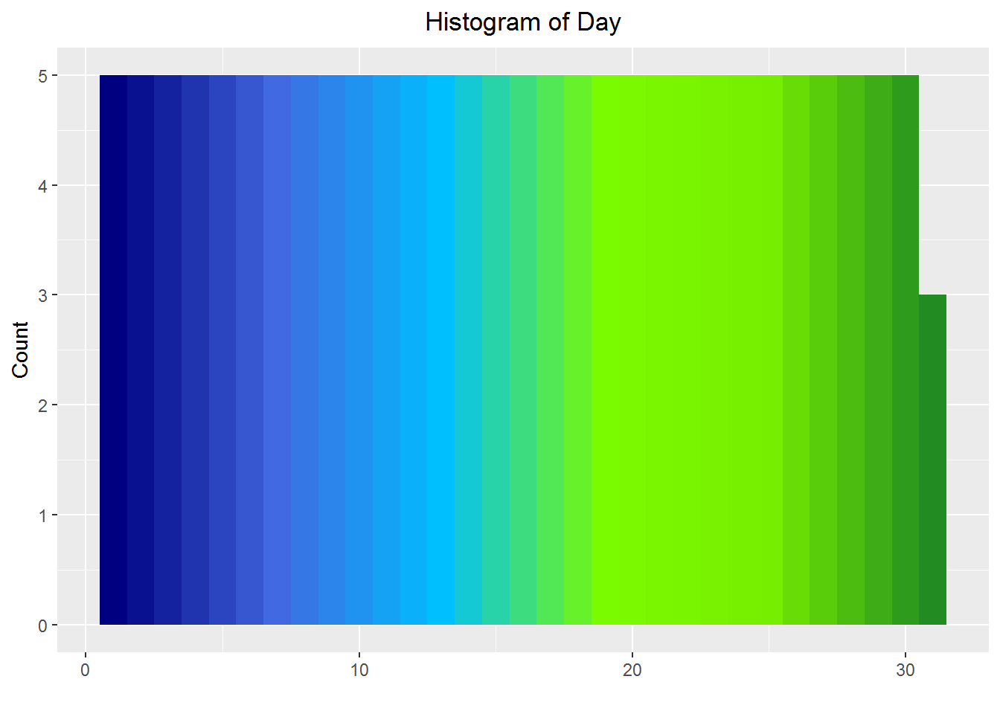

--- 
title: "Exploratory data analysis of OutputSoFar"
author: "script written by Jorik Schra"
date: "25 mei 2018"
output:  
   html_document: 
     toc: true 
     toc_float: true 
--- 


```r
# Packages 
library(ggplot2) 

# Data 
load("./df.rda") 

# Palette for plots 
rgb.palette <- colorRampPalette(c("navy", "royalblue", "deepskyblue1", 
                                  "lawngreen", "chartreuse2", "forestgreen")) 

# Functions 
## Print function for tables 
print_table <- function(dataframe, caption="Don`t forget your caption", font=12.5) { 
kable(dataframe, 
       format="html", 
       align=c("l", rep("c", ncol(dataframe)-1)), 
       caption=caption) %>% 
   kable_styling(bootstrap_options = c("striped", "hover", "responsive"), 
                 full_width=FALSE, 
                 font_size=font) 
} 
```

## Missing values 

```r
# Create an ordered data frame with missing value percentages per feature 
missing <- sapply(inputdata, function(x) sum(is.na(x))/nrow(inputdata)) 
missing <- data.frame("Feature"=names(missing), 
                      "Missing percentage"=missing, 
                      check.names=FALSE) 
missing <- missing[order(missing$`Missing percentage`, decreasing=TRUE),] 
row.names(missing) <- c() 
```


```r
# Plot the missing value percentages (only executed with data containing 60 or less features) 
ggplot(data=missing, aes(x=reorder(Feature, -`Missing percentage`), y=`Missing percentage`)) + 
   geom_bar(stat="identity", aes(fill=`Missing percentage`)) + 
   coord_flip() + 
   theme_bw() + 
   labs(x="Features", title="Percentage of missing values per feature") + 
   scale_y_continuous(breaks=seq(0, 1, .10), labels=paste0(seq(0, 100, 10), "%"), limits=c(0,1.05), expand=c(0,0)) +  
   theme(plot.title = element_text(hjust = 0.5)) + 
   guides(fill=FALSE) + 
   expand_limits(y=0) 
```



## Exploratory Data Analysis {.tabset .tabset-fade}
### Ozone

```r
ggplot(data=inputdata, aes(x=Ozone)) +
geom_histogram(bins=40, fill=rgb.palette(40)) +
labs(y="Count", title="Histogram of Ozone", x="") +
theme(plot.title = element_text(hjust = 0.5)) 
```



### Solar.R

```r
ggplot(data=inputdata, aes(x=Solar.R)) +
geom_histogram(bins=40, fill=rgb.palette(40)) +
labs(y="Count", title="Histogram of Solar.R", x="") +
theme(plot.title = element_text(hjust = 0.5)) 
```



### Wind

```r
bins <- length(unique(inputdata$Wind))
ggplot(data=inputdata, aes(x=Wind)) +
geom_histogram(bins=bins, fill=rgb.palette(bins)) +
labs(y="Count", title="Histogram of Wind", x="") +
theme(plot.title = element_text(hjust = 0.5)) 
```



### Temp

```r
bins <- length(unique(inputdata$Temp))
ggplot(data=inputdata, aes(x=Temp)) +
geom_histogram(bins=bins, fill=rgb.palette(bins)) +
labs(y="Count", title="Histogram of Temp", x="") +
theme(plot.title = element_text(hjust = 0.5)) 
```



### Month

```r
bins <- length(unique(inputdata$Month))
ggplot(data=inputdata, aes(x=Month)) +
geom_histogram(bins=bins, fill=rgb.palette(bins)) +
labs(y="Count", title="Histogram of Month", x="") +
theme(plot.title = element_text(hjust = 0.5)) 
```



### Day

```r
bins <- length(unique(inputdata$Day))
ggplot(data=inputdata, aes(x=Day)) +
geom_histogram(bins=bins, fill=rgb.palette(bins)) +
labs(y="Count", title="Histogram of Day", x="") +
theme(plot.title = element_text(hjust = 0.5)) 
```



